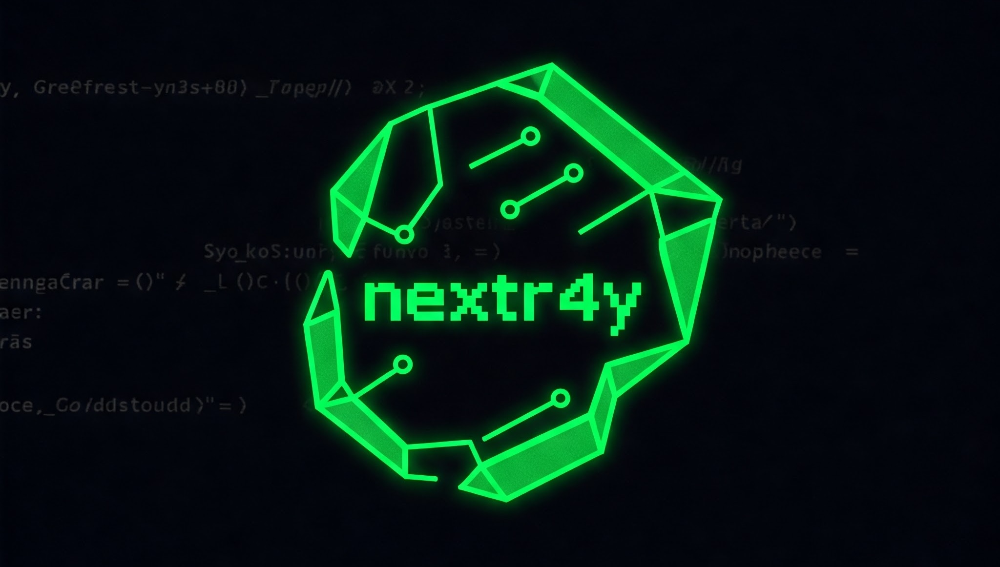

# nextr4y

<p align="center">
  
  <br>
  <b>Uncover the hidden internals of Next.js sites</b>
  <br>
</p>

<p align="center">
  <a href="#features">Features</a> •
  <a href="#installation">Installation</a> •
  <a href="#usage">Usage</a> •
  <a href="#examples">Examples</a> •
  <a href="#contributing">Contributing</a> •
  <a href="#license">License</a>
</p>

---

**nextr4y** is a powerful reconnaissance tool written in Golang designed to analyze Next.js applications and extract valuable information about their internal structure, routes, and dependencies. By scanning a target Next.js site, nextr4y can reveal build IDs, Next.js and React versions, asset prefixes, and route mappings that can be valuable for security assessments, debugging, or reverse engineering. Built with performance and reliability in mind, this Go-based tool is perfect for cybersecurity professionals and web application researchers.

## Features

- 🔍 **Next.js Detection** - Automatically detect if a site is built with Next.js
- 🏗️ **Version Fingerprinting** - Identify both Next.js and React versions in use
- 🗺️ **Route Mapping** - Discover and map internal routes defined in the application
- 📦 **Asset Discovery** - Identify and catalog JavaScript and CSS assets
- 🔧 **Build Manifest Analysis** - Extract and analyze the build manifest
- 📊 **Multiple Output Formats** - Get results in human-readable text or machine-parsable JSON
- 🔒 **Anti-Bot Evasion** - Uses CycleTLS-based page fetcher with different JA3 fingerprints and user agent presets to avoid bot detection

## Installation

### From Source

```bash
# Clone the repository
git clone https://github.com/rodrigopv/nextr4y.git
cd nextr4y

# Build the binary
go build -o nextr4y ./cmd/nextr4y
```

### Using Go Install

```bash
go install github.com/rodrigopv/nextr4y/cmd/nextr4y@latest
```

### Pre-built Binaries

Download pre-built binaries from the [Releases](https://github.com/rodrigopv/nextr4y/releases) page.

## Usage

```
nextr4y [command options] <target_url>
```

### Options

```
OPTIONS:
   --output FILE, -o FILE  Write output to FILE
   --format value, -f value  Output format (text or json) (default: "text")
   --help, -h              Show help information
```

## Examples

### Basic Scan

```bash
nextr4y https://example-nextjs-site.com
```

### Detailed Output to JSON File

```bash
nextr4y -f json -o results.json https://vercel.com
```

### Sample Output (Text Format)

```
+ ---------------------------------------------------------------- +
|                            nextr4y                               |
|                  github.com/rodrigopv/nextr4y                    |
+ ---------------------------------------------------------------- +

Scanning target: https://example-nextjs-site.com

Target is using Next.js: ✅
Build ID: 1a2b3c4d5e6f7g8h9i0j
Detected Next.js Version: 13.4.12
Detected React Version: 18.2.0
Asset Prefix: 
Calculated Asset Base URL: https://example-nextjs-site.tld/
Build Manifest Found: ✅
Build Manifest Executed OK: ✅
Routes (12 routes found):
  - / (18 assets)
  - /about (15 assets)
  - /blog (22 assets)
  - /blog/[slug] (24 assets)
  - /admin/reception/id-card (10 assets)
- /admin/reception/passport (10 assets)
  ...
Found 123 unique assets from manifest.
```

### Sample Output (JSON Format)

```json
{
  "BaseURL": "https://example.com/",
  "AssetBaseURL": "https://example.com/_next/",
  "IsNextJS": true,
  "BuildID": "SAMPLE_BUILD_ID_123",
  "AssetPrefix": "/_next",
  "Routes": {
    "/about": [
      "https://example.com/_next/static/chunks/pages/about-a1b2c3d4e5f6a7b8.js",
      "https://example.com/_next/static/chunks/framework-12345abcde.js",
      "https://example.com/_next/static/css/styles-about-abcdef.css"
    ],
    "/products/[productId]": [
      "https://example.com/_next/static/chunks/pages/products/%5BproductId%5D-f1e2d3c4b5a6f7e8.js",
      "https://example.com/_next/static/chunks/framework-12345abcde.js",
      "https://example.com/_next/static/chunks/shared-component-lib-xyz789.js",
      "https://example.com/_next/static/css/styles-products-fedcba.css"
    ]
  },
  "AllAssets": {
    "https://example.com/_next/static/chunks/pages/about-a1b2c3d4e5f6a7b8.js": true,
    "https://example.com/_next/static/chunks/framework-12345abcde.js": true,
    "https://example.com/_next/static/css/styles-about-abcdef.css": true,
    "https://example.com/_next/static/chunks/pages/products/%5BproductId%5D-f1e2d3c4b5a6f7e8.js": true,
    "https://example.com/_next/static/chunks/shared-component-lib-xyz789.js": true,
    "https://example.com/_next/static/css/styles-products-fedcba.css": true
  },
  "ManifestFound": true,
  "ManifestExecOK": true,
  "ExecutionError": null,
  "NextDataJSONRaw": "{\"props\":{\"pageProps\":{\"sampleData\": true, \"message\": \"This is placeholder _next/data content.\"}}}",
  "DetectedNextVersion": "14.1.0",
  "DetectedReactVersion": "18.2.0"
}
```

## How It Works

nextr4y works by:

1. **Initial Scanning** - Fetches the target page and looks for Next.js-specific markers
2. **__NEXT_DATA__ Extraction** - Parses the embedded Next.js configuration data
3. **Asset Detection** - Identifies JavaScript and CSS assets linked in the HTML
4. **Build Manifest Analysis** - Downloads and analyzes the build manifest to map routes
5. **Version Detection** - Uses multiple strategies to fingerprint Next.js and React versions
6. **Report Generation** - Compiles discovered data into structured output
7. **Bot Detection Evasion** - Implements CycleTLS for TLS fingerprint randomization with various JA3 signatures and rotating user agents to bypass common bot detection systems

## Use Cases

- **Security Research** - Reconnaissance and analysis of Next.js application structure
- **Penetration Testing** - Map routes and identify potential API endpoints
- **Website Analysis** - Learn how sites are built and structured with Next.js

## Contributing

Contributions are welcome! Please feel free to submit a Pull Request.

1. Fork the repository
2. Create your feature branch (`git checkout -b feature/amazing-feature`)
3. Commit your changes (`git commit -m 'Add some amazing feature'`)
4. Push to the branch (`git push origin feature/amazing-feature`)
5. Open a Pull Request

See [CONTRIBUTING.md](CONTRIBUTING.md) for more information.

## License

This project is licensed under the MIT License - see the [LICENSE](LICENSE) file for details.

## Disclaimer

nextr4y is designed for legitimate security research and web development purposes only. Use responsibly and only against websites you own or have explicit permission to test. The authors are not responsible for any misuse of this tool.

---