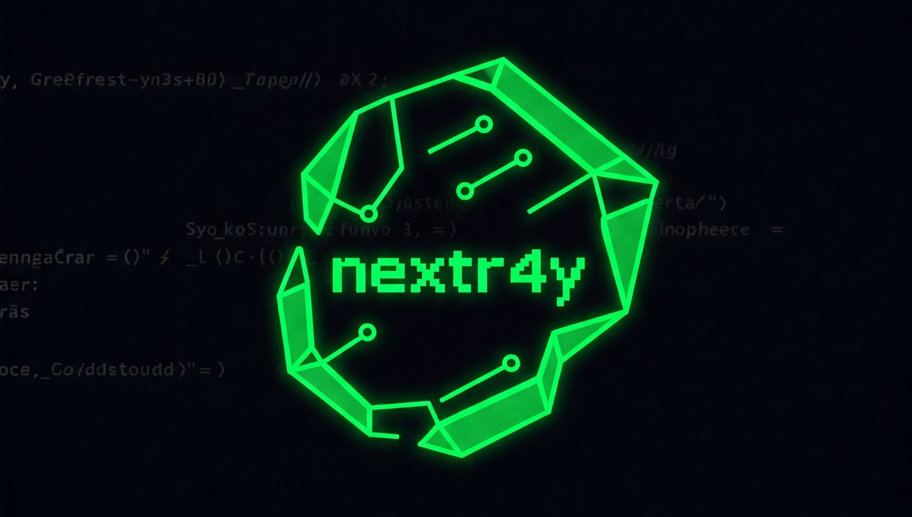
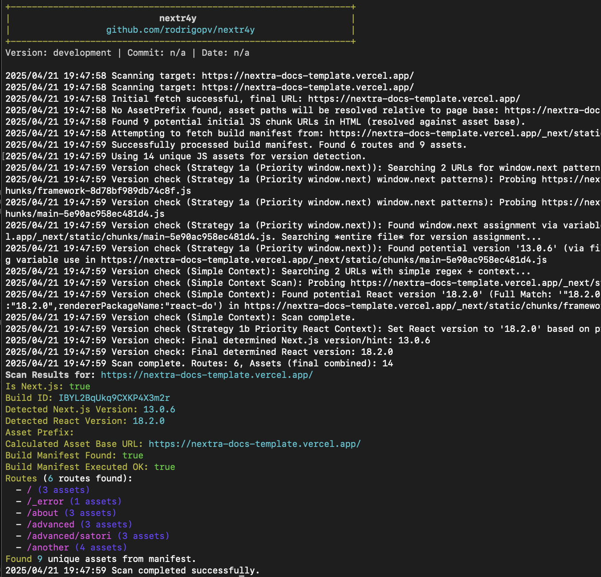

# nextr4y

<p align="center">
  
  <br>
  <b>Uncover the hidden internals of Next.js sites</b>
  <br>
</p>

<p align="center">
  <a href="#features">Features</a> •
  <a href="#installation">Installation</a> •
  <a href="#using-with-devbox">Using with Devbox</a> •
  <a href="#usage">Usage</a> •
  <a href="#examples">Examples</a> •
  <a href="#contributing">Contributing</a> •
  <a href="#license">License</a>
</p>

---

**nextr4y** is a powerful reconnaissance tool written in Golang designed to analyze Next.js applications and extract valuable information about their internal structure, routes, and dependencies. By scanning a target Next.js site, nextr4y can reveal build IDs, Next.js and React versions, asset prefixes, and route mappings that can be valuable for security assessments, debugging, or reverse engineering. It also features an MCP server mode for remote scanning and integration. Built with performance and reliability in mind, this Go-based tool is perfect for cybersecurity professionals and web application researchers.

## Features

- 🔍 **Next.js Detection** - Automatically detect if a site is built with Next.js
- 🏗️ **Version Fingerprinting** - Identify both Next.js and React versions in use
- 🗺️ **Route Mapping** - Discover and map internal routes defined in the application
- 📦 **Asset Discovery** - Identify and catalog JavaScript and CSS assets
- 🔧 **Build Manifest Analysis** - Extract and analyze the build manifest
- 📊 **Multiple Output Formats** - Get results in human-readable text or machine-parsable JSON
- 🔒 **Anti-Bot Evasion** - Uses CycleTLS-based page fetcher with different JA3 fingerprints and user agent presets to avoid bot detection
- 🌐 **MCP Server Mode** - Expose scanning functionality via a Model Context Protocol server for remote access and integration (e.g., with Cursor)


## Sample scan


## Installation

### From Source

Requires Go 1.25.5 or newer (the MCP SDK requirement).

```bash
# Clone the repository
git clone https://github.com/rodrigopv/nextr4y.git
cd nextr4y

# Build the binary
go build -o nextr4y ./cmd/nextr4y
```

### Using Go Install

```bash
go install github.com/rodrigopv/nextr4y/cmd/nextr4y@latest
```

### Pre-built Binaries

Download pre-built binaries from the [Releases](https://github.com/rodrigopv/nextr4y/releases) page.

## Using with Devbox

[Devbox](https://www.jetify.com/devbox/) provides a consistent development environment with all dependencies pre-configured. This ensures that everyone using the project has the same tooling and versions, eliminating "works on my machine" issues.

### Installing Devbox

```bash
# Follow the official installation instructions at:
# https://www.jetify.com/devbox/docs/installing_devbox/
```

### Using nextr4y with Devbox

After installing Devbox, you can run nextr4y without installing Go or any other dependencies:

```bash
# Clone and enter the repository
git clone https://github.com/rodrigopv/nextr4y
cd nextr4y

# Build the binary
devbox run build

# Run a scan
devbox run scan https://example-nextjs-site.com

# Run a scan with JSON output
devbox run scan:json https://example-nextjs-site.com

# Start the MCP server
devbox run serve
```

### Available Devbox Commands

- `devbox run build` - Build the nextr4y binary
- `devbox run test` - Run all tests
- `devbox run lint` - Run linter
- `devbox run scan [url]` - Scan a Next.js site
- `devbox run serve` - Start the MCP server

## Usage

```
nextr4y [command] [command options] [arguments...]
```

### Commands

```
COMMANDS:
   scan    Scan a Next.js site
   serve   Start an MCP server to handle nextr4y scan requests
   help    Shows a list of commands or help for one command
```

### Scan Command Options

```
OPTIONS:
   --output FILE, -o FILE  Write output to FILE
   --format value, -f value  Output format (text or json) (default: "text")
   --base-url value, -b value  Override the auto-detected base URL for asset resolution
   --insecure, -k          Skip TLS certificate verification (default: false)
   --rsc                  Independently probe an RSC response
   --sitemap              Read /sitemap.xml for additional same-origin URLs
   --crawl-pages N        Observe up to N additional linked pages (0–32, default 0)
   --help, -h              Show help information
```

### Serve Command Options

```
OPTIONS:
   --port value, -p value  Port for the MCP server (default: 8080)
   --host value           Host for the HTTP MCP server (default: "127.0.0.1")
   --transport value      http or stdio (default: "http")
   --help, -h             Show help information
```

## Examples

### Basic Scan

```bash
nextr4y scan https://example-nextjs-site.com
```

### Detailed Output to JSON File

```bash
nextr4y scan -f json -o results.json https://vercel.com
```

### Custom Base URL

```bash
nextr4y scan -b https://cdn.example.com https://example.com
```

### Skipping TLS Certificate Verification

```bash
nextr4y scan --insecure https://self-signed-site.com
```

> ⚠️ **Security caveat:** `--insecure` / `-k` disables TLS certificate
> validation entirely, so expired, self-signed and hostname-mismatched
> certificates are accepted and the connection is vulnerable to
> man-in-the-middle interception. Use it only against trusted or known targets
> such as CTF and lab environments. Verification stays **on** by default.

### Starting the MCP Server

```bash
nextr4y serve -p 9000 --host 127.0.0.1
```

### Sample Output (Text Format)

Abbreviated illustrative output (values vary by deployment):

```text
Scan Results for: https://example.com
Scan status: complete
Next.js detection: detected
HTTP status: 200
TLS verification disabled: false
Detected Next.js Version: 15.5.15
Router: mixed
Build ID: example-build
Asset Prefix: /f
Build Manifest: parsed
Manifest route patterns: 1 (public URL prefixes/rewrites not inferred)
  /sign-in (1 assets)
Manifest assets: 1
Webpack inventory: 1 async chunks (not routes; not fetched), public path https://example.com/f/_next/
Page observations: 1
  https://example.com -> https://example.com [html, HTTP 200]: 1 assets
```

### Sample Output (JSON Format)

Abbreviated illustrative JSON; CLI and MCP use the same scan-result fields:

```json
{
  "BaseURL": "https://example.com",
  "IsNextJS": true,
  "DetectionStatus": "detected",
  "ScanStatus": "complete",
  "Router": "mixed",
  "BuildID": "example-build",
  "AssetPrefix": "/f",
  "ManifestStatus": "parsed",
  "Routes": {
    "/sign-in": ["https://example.com/f/_next/static/chunks/pages/sign-in-abc.js"]
  },
  "RouteSources": {
    "/sign-in": ["https://example.com/f/_next/static/example-build/_buildManifest.js"]
  },
  "ManifestAssets": {
    "https://example.com/f/_next/static/chunks/pages/sign-in-abc.js": true
  },
  "ChunkMaps": [{
    "RuntimeURL": "https://example.com/f/_next/static/chunks/webpack-abc.js",
    "PublicPath": "https://example.com/f/_next/",
    "Chunks": {"21": "https://example.com/f/_next/static/chunks/21.def.js"}
  }],
  "PageObservations": [{
    "RequestedURL": "https://example.com",
    "FinalURL": "https://example.com",
    "Technique": "html",
    "HTTPStatus": 200,
    "BuildID": "example-build",
    "AssetPrefix": "/f",
    "Assets": ["https://example.com/f/_next/static/chunks/webpack-abc.js"]
  }],
  "ExecutionError": null
}
```

## How It Works

The scanner combines independent observations from response headers, HTML assets,
`__NEXT_DATA__`, inline Flight records, Pages build manifests, and JavaScript
runtime declarations. Each version technique returns attributed findings; a
separate resolver selects the strongest evidence. Conflicting equally strong
versions remain `Unknown`, with both findings retained.

- **Next.js versions:** explicit `window.next.version` declarations, including
  canary suffixes. A conservative constant-binding technique also handles an
  immediately preceding declaration; it never searches an unrelated module for
  a convenient semver.
- **React versions:** explicit React DOM renderer metadata. This is the served
  runtime version, which may differ from the application's package.json.
- **App Router:** inline Flight and runtime markers. The parser joins streamed
  string segments and reads root build metadata and client import records without
  executing page JavaScript. Unsupported records are left opaque. Flight is an
  internal format; not every release exposes a build ID.
- **Pages Router:** `__NEXT_DATA__` and build-manifest route/asset extraction remain
  supported. A Flight build ID also triggers an independent manifest probe,
  allowing mixed App/Pages deployments to expose their Pages routes. Missing
  `__NEXT_DATA__` is not an App Router error. Manifest execution
  has a one-second interrupt deadline.
- **Deployment:** router, bundler, OpenNext adapter, and serving platform are
  reported separately. `x-opennext: 1` identifies the adapter, not its package
  version. Cloudflare headers alone do not establish OpenNext or Workers hosting.
- **Assets:** script, preload, stylesheet, and Flight imports preserve prefixes,
  absolute CDN URLs, and query parameters. `ObservedAssetPrefixes` is distinct
  from declared `AssetPrefix`; deployment `dpl` values are distinct from build IDs.
- **Route evidence:** `Routes` maps manifest route patterns to assets, with
  `RouteSources` identifying the manifest. These patterns do not establish public
  URLs through rewrites; an asset prefix is not necessarily a routing base path.
  `ChunkMaps` separately inventories async filenames from supported static Webpack
  runtime resolver shapes. Chunk IDs are not routes, and this inventory is not
  automatically downloaded. Unsupported resolver expressions are left opaque.
  `PageObservations` associates HTML/Flight assets with requested and final URLs.
- **Serving platforms:** multiple platform headers can indicate layered hosting;
  Cloudflare and Vercel can both appear in `ServingPlatforms`.
- **HTTP:** CycleTLS profiles are retained. A scan-local cookie jar supports auth
  redirects; redirect history, status, and response headers are retained, including
  non-200 responses. Cookie values stay out of report headers. Cookies do not
  persist between CLI scans.

Techniques remain additive through `DefaultTechniques()` / `AssetTechnique`.
They inspect the same successful asset snapshot independently, without
short-circuiting on an earlier finding. There is no persistent fetch cache or
cached failure. Existing `Fetcher` and `VersionDetector` implementations remain
usable; optional richer interfaces expose response metadata and findings.

### Optional probes

```bash
nextr4y scan --rsc --sitemap -f json https://nutrihub.cl
```

`--rsc` sends a separate `RSC: 1` GET with an `_rsc` query marker. `--sitemap` reads the origin's
`/sitemap.xml`; it does not traverse sitemap indexes or crawl every discovered
page. Same-origin HTML links are collected by default. `DiscoveredURLs` is an
observed, non-exhaustive list; `Routes` retains manifest route mappings.

Use `--crawl-pages 5` to observe up to five additional discovered same-origin
pages. This follows concrete links, never manifest templates or chunk IDs. Each
page retains its own asset/build observations; additional pages do not overwrite
initial-target version findings. No extra page crawl runs by default.

Version techniques inspect the initial page's JavaScript assets independently,
falling back to manifest assets if the page exposes no JavaScript. Manifest
recovery itself does not trigger downloads of every route's bundles.

Limits: 128 JavaScript assets, 256 discovered URLs, 10 redirect hops, 20 seconds
per HTTP attempt, and 16 MiB per response accepted for parsing. CycleTLS buffers
bodies internally before the size check; this is not a network streaming limit.
No browser execution or vulnerability exploitation is performed by these probes.

### Result compatibility

Existing JSON field names remain. `IsNextJS` is now `null` when evidence is
unavailable (for example, a redirect loop or blocked response), `false` when a
successful scan found no Next.js evidence, and `true` when detected.
`DetectionStatus` and `ScanStatus` distinguish identification from completion.
`ExecutionError` serializes as a string or null; optional probe failures and
conflicts appear in `Warnings`. JSON stdout contains no banner. Progress is logged to stderr by default, including
HTTP attempts, redirects, asset counts, technique matches/misses, warnings, and
the final scan status. Redirect stderr separately when saving machine-readable output.

`ManifestStatus` distinguishes `not_applicable`, `unavailable`, `invalid`, and
`parsed`; `not_applicable` means no build ID was available for this probe. `Findings` contains the technique, URL, confidence, and evidence for
each observation; generic semver candidates never determine Next.js versions.
Headers, asset paths, and public runtime declarations are fingerprints, not
independent proof of server package versions.

### Regression tests

```bash
go test ./...
go test -race ./...
```

Minimal fixtures in `internal/versiondetect/testdata` reproduce the observed
Nutrihub, DOGE, Vercel, chatbot, and IP-target signatures. Local HTTP tests cover
cookie redirects, transport failures, TLS verification, RSC negotiation, Pages
manifests, prefixed assets, and non-200 detection without relying on live sites.

## MCP Server

The MCP (Model Context Protocol) server mode allows nextr4y to be used as a service that accepts scan requests remotely. This is useful for:

- **Integration** - Incorporate nextr4y scanning into your own applications or workflows
- **Automation** - Schedule and automate scans of Next.js sites
- **API Access** - Access nextr4y functionality through a standardized API interface
- **AI Integration Bridge** - Serve as a bridge between the data provided by nextr4y and AI-driven tools or solutions (like Cursor) for enhanced analysis and interaction.

When using the MCP server, clients can send requests to scan specific targets and receive the scan results as structured responses. The server handles the execution of the scans and returns the results to the client.

### Using the MCP Server

Start the MCP server:

```bash
nextr4y serve -p 8080 --host 127.0.0.1
```

### Transports and Codex setup

HTTP mode serves both transports on the same port:

```bash
nextr4y serve --transport http --host 127.0.0.1 --port 8080
```

- `http://127.0.0.1:8080/mcp`: Streamable HTTP for modern clients.
- `http://127.0.0.1:8080/sse`: legacy HTTP+SSE for older configurations.

For local Codex use, stdio lets Codex launch the process without a listening port:

```bash
codex mcp add nextr4y -- /absolute/path/to/nextr4y serve --transport stdio
```

Equivalent configuration in `~/.codex/config.toml`:

```toml
[mcp_servers.nextr4y]
command = "/absolute/path/to/nextr4y"
args = ["serve", "--transport", "stdio"]
tool_timeout_sec = 300
```

To use an already-running HTTP server, use this configuration instead:

```toml
[mcp_servers.nextr4y]
url = "http://127.0.0.1:8080/mcp"
tool_timeout_sec = 300
```

Choose one configuration. The longer tool timeout accommodates scans with many
assets or optional page probes; slow targets can still exceed it. The scanner
currently uses per-request HTTP timeouts and does not propagate MCP cancellation
through all scan work. Stdio stdout contains only MCP messages; logs go to stderr.
`--host` and `--port` apply only to HTTP mode.

The server uses `mcp-go v1.0.0`, supports version negotiation for older clients,
and supplies initialization instructions plus read-only/open-world tool
annotations. The HTTP default changed from all interfaces to localhost. Requests
with a foreign `Origin` are rejected, and the SDK's localhost protection remains
enabled. Remote access is opt-in through `--host`; authentication is not built in.
For remote hosting, configure an authenticated HTTPS proxy. A loopback proxy
should rewrite Host/Origin consistently rather than disable localhost protection.

See [Codex MCP configuration](https://developers.openai.com/codex/mcp) for the
supported connection options. Integration tests exercise initialization/discovery
and scanning over stdio, Streamable HTTP, and legacy SSE; they do not require a
Codex account or change your local Codex configuration.

#### Available Tools

The `nextr4y_scan` tool uses the same scanner, independent detection techniques,
manifest recovery, prefix handling, and formatters as the CLI. Its tool description
explains the evidence distinctions to MCP clients.

| Parameter | Type | Default | Behavior |
| --- | --- | --- | --- |
| `url` | string, required | — | Target URL; a hostname without a scheme uses HTTPS |
| `format` | string | `json` | `json` or `text` |
| `base_url` | string | auto-detected | Override asset resolution, not public route URLs |
| `insecure` | boolean | `false` | Skip TLS certificate verification for this scan |
| `rsc` | boolean | `false` | Independently request RSC with an `_rsc` query marker |
| `sitemap` | boolean | `false` | Read `/sitemap.xml`; does not traverse sitemap indexes |
| `crawl_pages` | integer | `0` | Observe 0–32 additional discovered same-origin pages |

Invalid option types, unsupported formats, and out-of-range/fractional crawl
limits are rejected before scanning. Each request gets a separate HTTP cookie
session. TLS verification stays enabled unless `insecure` is explicitly true.
The CLI's `--output` has no MCP equivalent: results return to the caller instead
of writing a server-side file.

Example `tools/call` request:

```json
{
  "jsonrpc": "2.0",
  "id": 1,
  "method": "tools/call",
  "params": {
    "name": "nextr4y_scan",
    "arguments": {
      "url": "https://nutrihub.cl",
      "format": "json",
      "rsc": true,
      "sitemap": true,
      "crawl_pages": 5
    }
  }
}
```

#### Extracting selected routes

After `nextr4y_scan`, call **`nextr4y_extract_routes`** with the parsed scan object
and exact route patterns. You can pass only `BaseURL`, `BuildID`, the selected
entries of `Routes`, and relevant `ChunkMaps` to keep the request small.

```json
{
  "name": "nextr4y_extract_routes",
  "arguments": {
    "scan": {
      "BaseURL": "https://example.com",
      "BuildID": "example-build",
      "Routes": {
        "/onboarding/verification/id-card/back/[verificationAttemptId]": [
          "https://example.com/f/_next/static/chunks/pages/onboarding/back-abc.js"
        ]
      },
      "ChunkMaps": []
    },
    "routes": ["/onboarding/verification/id-card/back/[verificationAttemptId]"],
    "follow_lazy": false,
    "max_assets": 64,
    "max_depth": 2
  }
}
```

This is a `tools/call` params object. The URLs above are illustrative; use the
actual manifest mappings returned by your scan. No verification attempt ID is
needed: the extractor downloads the listed bundles, without visiting the route
or invoking APIs mentioned in the code.

| Parameter | Default | Behavior |
| --- | --- | --- |
| `scan` | required | Prior scan object or subset described above; at most 8 MiB serialized |
| `routes` | required | 1–32 exact manifest patterns; unknown/empty mappings are rejected |
| `follow_lazy` | `false` | Follow literal Webpack module `require.e(chunkID)` candidates with an unambiguous matching public-path inventory |
| `max_assets` | `64` | Total unique asset requests, 1–128 |
| `max_depth` | `2` | Maximum lazy dependency depth, 0–4; manifest assets start at depth 0 |
| `insecure` | `false` | Explicitly disable download TLS verification; not inherited from the scan |

The tool creates a new private directory under the server's temporary directory
and returns `extraction_id`, `directory`, `index_file`, asset statuses/hashes,
module counts, and warnings. Shared manifest assets download once. Each raw
bundle is preserved under a filename derived from its URL hash; the index records
the body SHA-256, requested/final URLs, status, and route membership.

Use **`nextr4y_read_extraction`** to inspect the detailed index and code without
requiring filesystem access to the server:

```json
{
  "name": "nextr4y_read_extraction",
  "arguments": {
    "extraction_id": "<ID returned by extraction>",
    "file": "index.json",
    "offset": 0,
    "limit": 12000
  }
}
```

Read `Assets[].Analysis.Modules` in the index, then request a module's `File`.
`offset` and `next_offset` count Unicode characters; `limit` is 1–16000 (default
12000). A null `next_offset` means end of file. Only files registered to that
extraction can be read. Remote source text is untrusted data, not instructions.

Supported Webpack `.push` module tables are parsed without executing JavaScript.
Each function is saved as an exact compiled-code slice with byte offsets into
the original bundle. `Requires`, `LazyChunkIDs`, and literal URL/path `References`
help an MCP client inspect the logic. These are static candidates: nested scope
shadowing, dynamic expressions, other bundlers, and unsupported syntax can leave
ambiguities. Functions remain minified when the original code is minified.
There is no automatic business-logic summary or original TypeScript recovery.

`Dependencies` records lazy edges as saved, failed, unresolved, ambiguous,
not-followed, or limited. `status: complete` means the selected downloads
completed, not that every runtime dependency was recovered. Global framework or
`_app` assets absent from selected manifest entries are not silently added.
Referenced API URLs and images are indexed as strings, not automatically fetched.
Source maps and backend implementation are not recovered by this first version.

Downloads use the existing 16 MiB response parsing bound, with a 64 MiB aggregate
accepted-body limit. JavaScript analysis is limited to 4 MiB per bundle, 2048
modules and 512 path/URL candidates per analyzed bundle. Module files duplicate
parts of raw bundles. HTTP may buffer a response before enforcing limits.
Cancellation is checked between requests; an in-flight request uses the existing
HTTP timeout. Extraction progress logs to stderr.

Packages persist until removed from disk or cleaned by the OS. The server keeps
extraction IDs only for its process lifetime; after a restart, local packages
remain available through their returned directory paths. There is no automatic
retention cleanup. The extraction tool is annotated as writing local artifacts;
its companion read tool is read-only. This workflow is MCP-only; no CLI `extract`
command is currently exposed.

#### Reading MCP results

The server supports stdio and Streamable HTTP at `/mcp`, with legacy HTTP+SSE
at `/sse` (POST endpoint `/message`). Tool results contain a text content block:
`format: "json"` puts the complete serialized scan object in `content[0].text`;
`format: "text"` uses the CLI's human-readable report. JSON is not a separate
MCP `structuredContent` object.

| Result fields | Meaning |
| --- | --- |
| `Routes`, `RouteSources`, `ManifestAssets`, `Manifests` | Manifest route patterns, source URLs, asset inventory, and probe outcomes; includes manifests recovered from Flight build IDs |
| `ChunkMaps` | Supported Webpack runtime chunk-ID-to-filename mappings; not route tables and not automatically fetched |
| `PageObservations` | Requested/final page URLs, HTML or RSC technique, HTTP status, build/prefix metadata, and observed assets |
| `DiscoveredURLs` | Non-exhaustive concrete links from HTML and optional sitemap discovery |
| `Findings`, `Router`, `Bundler`, `Adapter`, `ServingPlatforms` | Attributed detection evidence; mixed routers and layered hosting remain distinguishable |
| `ScanStatus`, `DetectionStatus`, `Warnings`, `ExecutionError` | Completion, identification, optional-probe issues, and execution errors |

An asset prefix does not prove a public routing prefix. App Router page
observations do not enumerate every route. Version detection remains scoped to
the initial page's JavaScript, with manifest fallback when no JavaScript is
observed; crawling additional pages does not overwrite those version findings.

Execution failures set MCP `isError: true`. When partial evidence exists,
JSON output remains a valid scan object with `ExecutionError` as a string and
`IsNextJS: null` if detection is unknown. Invalid arguments or failures with no
scan object return a plain-text MCP error. Optional-probe warnings remain in
`Warnings`; callers should inspect `ScanStatus` as well as `isError`.

Verbose HTTP/probe progress is logged to the server's stderr. It is not streamed
as MCP progress notifications and does not contaminate JSON tool content.

### Using with Cursor

You can integrate nextr4y with Cursor IDE using the MCP protocol:

1. Start the nextr4y MCP server:

```bash
go run github.com/rodrigopv/nextr4y/cmd/nextr4y serve
```

2. Create or edit the Cursor MCP configuration file at `~/.cursor/mcp.json`:

```json
{
  "mcpServers": {
    "nextr4y": {
      "url": "http://localhost:8080/mcp"
    }
  }
}
```

3. Restart Cursor for the changes to take effect.

4. You can now use nextr4y from within Cursor to scan Next.js sites and analyze their structure.

## Use Cases

- **Security Research** - Reconnaissance and analysis of Next.js application structure
- **Penetration Testing** - Map routes and identify potential API endpoints
- **Website Analysis** - Learn how sites are built and structured with Next.js
- **Internal View Reconstruction** - Use MCP to connect nextr4y data (routes, assets) to IDEs such as cursor to understand or mimic internal application views for deeper analysis or vulnerability hunting.

## Contributing

Contributions are welcome! Please feel free to submit a Pull Request.

1. Fork the repository
2. Create your feature branch (`git checkout -b feature/amazing-feature`)
3. Commit your changes (`git commit -m 'Add some amazing feature'`)
4. Push to the branch (`git push origin feature/amazing-feature`)
5. Open a Pull Request

See [CONTRIBUTING.md](CONTRIBUTING.md) for more information.

## License

This project is licensed under the MIT License - see the [LICENSE](LICENSE) file for details.

## Disclaimer

nextr4y is designed for legitimate security research and web development purposes only. Use responsibly and only against websites you own or have explicit permission to test. The authors are not responsible for any misuse of this tool.

---
